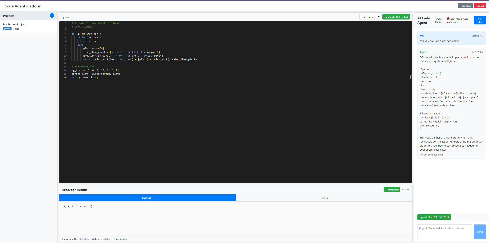

# Code Agent Platform

A full-stack web application that combines AI-powered code assistance with safe code execution capabilities. Built with Django REST API backend and React TypeScript frontend, providing an integrated development environment with intelligent agent support.


*Complete development environment with Monaco code editor, dual-mode AI chat, project management, and safe code execution*

## Core Functionality

The platform provides a secure, web-based coding environment with advanced AI integration:

1. **Safe Code Execution** - Multi-language sandboxed execution environment
2. **Dual-Mode AI Interaction** - Chat mode for conversation, Agent mode for automatic code application
3. **Document Processing** - Upload and process PDF, TXT, PNG files for enhanced AI context
4. **Knowledge Base Integration** - RAG-powered responses using uploaded documents
5. **Project Management** - Organize code sessions with file persistence
6. **GitHub Integration** - Search and analyze code repositories

## Key Features

### Dual-Mode AI Interaction
- **Chat Mode**: Conversational AI assistance for questions and explanations
- **Agent Mode**: Automatic code extraction and insertion into the editor
- **Smart Code Detection**: Automatically identifies and applies code blocks from AI responses
- **Mode Switching**: Toggle between modes with radio button interface

### Advanced File Upload System
- **Multi-Format Support**: Upload PDF, TXT, PNG, JPG, JPEG, and DOCX files
- **Content Extraction**: Automatic text extraction from various file formats
- **RAG Integration**: Uploaded files enhance AI responses with relevant context
- **Knowledge Base Building**: Files are processed and stored for future reference

### Enhanced Security and Execution
- **Sandboxed Code Execution**: Safe execution environment with import restrictions
- **Multi-Language Support**: Python, JavaScript, and Java execution
- **Library Compatibility**: Works with popular libraries like NumPy, Pandas
- **Real-time Error Reporting**: Instant feedback on code issues

## Interface Overview

The platform provides a comprehensive development environment as shown in the screenshot above:

**Left Panel - Project Management:**
- Project creation and file organization
- Language selection and project metadata
- File tree navigation and management

**Center Panel - Code Editor:**
- Monaco editor with syntax highlighting for Python, JavaScript, and Java
- Real-time error detection and autocomplete
- Professional IDE-like coding experience

**Right Panel - AI Chat Interface:**
- Dual-mode selector (Chat/Agent mode toggle)
- Real-time conversation with AI assistant
- File upload functionality for knowledge base enhancement
- Tool usage indicators and response times

**Bottom Panel - Execution Results:**
- Safe code execution output
- Error messages and debugging information
- Performance metrics and execution time tracking

## Architecture Overview

### Backend (Django REST API)
- **Safe Code Execution Engine** - Sandboxed environment for running user code
- **AI Agent Integration** - Intelligent assistant for programming tasks
- **File Processing System** - Multi-format document upload and extraction
- **Authentication System** - Token-based user management
- **Project Management** - Organize and persist coding sessions
- **Knowledge Base** - RAG-powered document storage and retrieval

### Frontend (React + TypeScript)
- **Monaco Code Editor** - Professional code editing with syntax highlighting
- **Dual-Mode Chat Interface** - Switch between chat and agent modes
- **File Upload Component** - Drag-and-drop document upload
- **Project Sidebar** - File and project management
- **Execution Panel** - Display code results and error messages
- **Mode Selector** - Toggle between conversation and code application modes

## Detailed Module Structure and Functions

### Backend Core Modules (django_app/)

#### Main Django Configuration
**File: `codeagent_platform/settings.py`**
- **Function**: Central Django configuration with environment variable support
- **Use**: Configure database, authentication, CORS settings, and agent parameters
- **Key Components**:
  - `SECRET_KEY`: Django security key loaded from environment
  - `CORS_ALLOWED_ORIGINS`: Frontend integration settings
  - `REST_FRAMEWORK`: API authentication and pagination configuration
  - `AGENT_CONFIG`: Code execution and memory limits

**File: `codeagent_platform/urls.py`**
- **Function**: Main URL routing for all API endpoints
- **Use**: Route frontend requests to appropriate Django apps
- **Endpoints**:
  - `/api/auth/token/` - Authentication
  - `/api/code/` - Code execution and projects
  - `/api/chat/` - AI agent interactions
  - `/api/knowledge/` - File uploads and knowledge base

#### Code Execution Engine (code_execution/)
**File: `models.py`**
- **CodeProject Model**
  - **Function**: Store user projects with metadata
  - **Use**: Organize coding sessions and maintain project state
  - **Fields**: name, description, language, user, created_at, updated_at

- **CodeFile Model**
  - **Function**: Individual files within projects
  - **Use**: Store and version code files
  - **Fields**: project, filename, content, created_at, updated_at

- **CodeExecution Model**
  - **Function**: Track execution history and results
  - **Use**: Monitor code runs, performance, and errors
  - **Fields**: user, project, code_content, language, status, output, execution_time

- **ErrorReport Model**
  - **Function**: Capture and analyze code errors
  - **Use**: Provide debugging assistance and error patterns
  - **Fields**: user, execution, error_type, error_message, traceback

**File: `services.py`**
- **CodeExecutionService Class**
  - **Function**: Core execution engine with security sandboxing
  - **Use**: Safely execute user code in isolated environment

- **_execute_python() Method**
  - **Function**: Safe Python code execution with import restrictions
  - **Use**: Run Python code while blocking dangerous modules
  - **Security**: Blocks subprocess, socket imports; allows numpy, pandas

- **_execute_javascript() Method**
  - **Function**: Node.js execution for JavaScript code
  - **Use**: Execute JavaScript using Node.js runtime
  - **Features**: Timeout protection, error capturing

- **_execute_java() Method**
  - **Function**: Compile and run Java code
  - **Use**: Support Java development with compilation step
  - **Process**: javac compilation followed by java execution

- **_add_python_safety_wrapper() Method**
  - **Function**: Security layer preventing dangerous operations
  - **Use**: Wrap user code with import restrictions and safety checks
  - **Protection**: Blocks file system access, network operations

- **ProjectService Class**
  - **Function**: Manage code projects and file operations
  - **Use**: Create, update, and organize user projects
  - **Methods**: create_project(), save_file(), get_project_files()

**File: `views.py`**
- **execute_code() Function**
  - **Function**: API endpoint for running user code
  - **Use**: Receive code from frontend, execute safely, return results
  - **Security**: User authentication, input validation, execution limits

- **create_project() Function**
  - **Function**: Create new coding projects
  - **Use**: Initialize project structure for users
  - **Features**: Language detection, metadata storage

- **list_projects() Function**
  - **Function**: Get user's project list
  - **Use**: Display available projects in frontend sidebar
  - **Filtering**: User-specific, active projects only

#### AI Agent System (agent_chat/)
**File: `models.py`**
- **Conversation Model**
  - **Function**: Chat session management
  - **Use**: Track conversation history and context
  - **Fields**: user, title, created_at, is_active, message_count

- **Message Model**
  - **Function**: Individual chat messages with role tracking
  - **Use**: Store user and AI responses with metadata
  - **Fields**: conversation, role, content, tools_used, execution_time

- **AgentSession Model**
  - **Function**: Agent state and configuration
  - **Use**: Maintain agent memory and preferences
  - **Fields**: user, conversation, agent_config, session_data

**File: `views.py`**
- **start_conversation() Function**
  - **Function**: Initialize new chat session
  - **Use**: Create conversation and agent session for user
  - **Returns**: conversation_id, session_id, title

- **send_message() Function**
  - **Function**: Process user input and generate AI responses
  - **Use**: Core chat functionality with mode detection
  - **Features**: Tool usage, workflow selection, error handling

- **get_conversation_history() Function**
  - **Function**: Retrieve chat history
  - **Use**: Load previous messages for context
  - **Pagination**: Efficient loading of large conversations

#### Knowledge Base System (knowledge_base/)
**File: `services.py`**
- **KnowledgeBaseService Class**
  - **Function**: Document processing and RAG functionality
  - **Use**: Manage uploaded documents and vector storage

- **add_document() Method**
  - **Function**: Process and store documents in vector database
  - **Use**: Add uploaded files to knowledge base
  - **Process**: Extract text, create chunks, generate embeddings

- **search_documents() Method**
  - **Function**: Retrieve relevant information for queries
  - **Use**: Find context for AI responses
  - **Algorithm**: Vector similarity search with scoring

- **AgentService Class**
  - **Function**: AI agent logic and message processing
  - **Use**: Handle dual-mode operation and LLM integration

- **_process_with_llm() Method**
  - **Function**: Process messages using actual LLM integration
  - **Use**: Generate intelligent responses with RAG context
  - **Fallback**: Direct LLM when no relevant documents found

- **_direct_llm_response() Method**
  - **Function**: Get direct response from LLM for general programming assistance
  - **Use**: Handle general coding questions without document context
  - **Specialization**: Programming-focused prompts and examples

**File: `models.py`**
- **Document Model**
  - **Function**: Store processed documents and metadata
  - **Use**: Track uploaded files and their processing status
  - **Fields**: title, content, source_type, language, uploaded_by

- **DocumentChunk Model**
  - **Function**: Text chunks for vector search
  - **Use**: Enable efficient similarity search
  - **Fields**: document, content, chunk_index, metadata, embeddings

- **VectorStoreIndex Model**
  - **Function**: Manage vector database indices
  - **Use**: Track indexing status and performance
  - **Fields**: name, status, document_count, last_updated

**File: `views.py`**
- **upload_file() Function**
  - **Function**: Upload and process files for the knowledge base
  - **Use**: Handle file uploads from frontend
  - **Supported Formats**: PDF, TXT, PNG, JPG, JPEG, DOCX

- **extract_content_from_file() Function**
  - **Function**: Extract text content from different file types
  - **Use**: Convert various formats to searchable text
  - **Methods**: Text reading, PDF parsing, OCR for images

- **list_documents() Function**
  - **Function**: List all documents in the knowledge base
  - **Use**: Display uploaded files to users
  - **Features**: User filtering, metadata display

### Frontend Core Modules (frontend/src/)

#### Main Application Components
**File: `App.tsx`**
- **Function**: Root application component
- **Use**: Authentication routing and global state management
- **Features**: Route protection, theme coordination, error boundaries

**File: `components/MainLayout.tsx`**
- **Function**: Primary development interface layout
- **Use**: Orchestrate code editor, chat, and project management
- **State Management**: Active project, code content, execution results

- **handleCodeInsert() Method**
  - **Function**: Insert code from AI responses into editor
  - **Use**: Enable Agent mode auto-code application
  - **Logic**: Append to existing code or replace empty editor

#### Code Editing System
**File: `components/CodeEditor.tsx`**
- **Function**: Monaco editor integration with multi-language support
- **Use**: Professional code editing experience
- **Features**: Syntax highlighting, autocomplete, error detection

- **Language Support**
  - **Python**: Full syntax highlighting and error detection
  - **JavaScript**: ES6+ support with modern features
  - **Java**: Complete Java language support
  - **Auto-detection**: Language detection from file extensions

**File: `components/CodeExecutionPanel.tsx`**
- **Function**: Display execution results and error messages
- **Use**: Show code output, performance metrics, and debugging info
- **Features**: Syntax highlighting for output, execution time display

#### Chat and AI Integration
**File: `components/ChatPanel.tsx`**
- **Function**: Dual-mode messaging interface with AI agent
- **Use**: Enable both conversational and code-focused interactions

- **Chat Mode Features**
  - **Conversational AI**: Natural language responses
  - **Context Preservation**: Maintains conversation history
  - **Tool Display**: Shows which tools the agent used

- **Agent Mode Features**
  - **Automatic Code Extraction**: Detects code blocks in responses
  - **Editor Integration**: Auto-inserts code into Monaco editor
  - **Code Pattern Recognition**: Identifies multiple programming languages

- **extractCodeFromResponse() Method**
  - **Function**: Extract code blocks from markdown format
  - **Use**: Parse AI responses for code content
  - **Regex**: Supports multiple language tags and formats

- **handleFileUpload() Method**
  - **Function**: Process uploaded files for knowledge base
  - **Use**: Enable document upload for enhanced AI context
  - **Validation**: File type checking and size limits

#### File Upload System
**File Upload Component**
- **Function**: Drag-and-drop document upload interface
- **Use**: Allow users to upload documents for RAG enhancement
- **Supported Types**: PDF, TXT, PNG, JPG, JPEG, DOCX

- **File Processing Workflow**
  1. **File Selection**: User selects or drags files
  2. **Validation**: Check file types and sizes
  3. **Upload**: Send to backend processing
  4. **Extraction**: Backend extracts text content
  5. **Indexing**: Add to vector database
  6. **Availability**: Ready for AI context enhancement

#### Project Management
**File: `components/ProjectSidebar.tsx`**
- **Function**: Project creation and file management interface
- **Use**: Organize coding sessions and maintain project structure
- **Features**: Project switching, file creation, metadata display

#### Service Layer
**File: `services/api.ts`**
- **ApiService Class**: Complete backend communication layer
- **Use**: Handle all API interactions with type safety

- **executeCode() Method**
  - **Function**: Send code to execution engine
  - **Use**: Execute user code safely on backend
  - **Parameters**: code, language, project_id

- **sendMessage() Method**
  - **Function**: Chat with AI agent
  - **Use**: Send user messages and receive AI responses
  - **Features**: Mode detection, tool usage, workflow selection

- **uploadFile() Method**
  - **Function**: Upload files to knowledge base
  - **Use**: Send documents for processing and RAG integration
  - **Format**: FormData with multipart encoding

- **createProject() Method**
  - **Function**: Project management operations
  - **Use**: Initialize new coding projects
  - **Features**: Language detection, metadata setup

**File: `types/index.ts`**
- **Function**: TypeScript type definitions for all data structures
- **Use**: Ensure type safety across frontend-backend communication
- **Coverage**: API responses, component props, state interfaces

**File: `hooks/useAuth.tsx`**
- **Function**: Authentication state management
- **Use**: Handle login/logout and session persistence
- **Features**: Token management, auto-refresh, error handling

### Original RAG System Modules (Root Directory)

#### Core Agent Logic
**File: `agent_core.py`**
- **Agent Class**: Main AI agent implementation
- **Function**: Tool management and workflow execution
- **Use**: Coordinate LLM, tools, and memory for intelligent responses

- **Tool Integration**
  - **GitHub Search**: Find relevant code examples
  - **Document Search**: Query knowledge base
  - **Code Execution**: Run and test code snippets
  - **Memory Management**: Maintain conversation context

**File: `main_app.py`**
- **Function**: Command-line interface for the original RAG system
- **Use**: Interactive chat loop and command processing
- **Integration**: Connects all system components for CLI usage

#### LLM and RAG Integration
**File: `llm_integration.py`**
- **LLMManager Class**: OpenAI API integration and model management
- **Function**: Handle LLM requests with proper configuration
- **Use**: Generate AI responses with temperature and token control

- **RAGChain Class**: RAG chain implementation with retrieval augmentation
- **Function**: Combine document retrieval with LLM generation
- **Use**: Provide context-aware responses using knowledge base

- **ConversationManager Class**: Manages conversations and chat history
- **Function**: Track message history and conversation context
- **Use**: Maintain state across multiple interactions

#### Document Processing
**File: `document_processor.py`**
- **DocumentProcessor Class**: Multi-format document support
- **Function**: Extract and preprocess text from various file types
- **Use**: Convert documents to searchable text chunks

- **Supported Formats**
  - **PDF**: Text extraction with metadata preservation
  - **DOCX**: Microsoft Word document processing
  - **TXT**: Plain text with encoding detection
  - **MD**: Markdown parsing with structure preservation

#### Vector Storage
**File: `vector_store.py`**
- **VectorStore Class**: ChromaDB integration for document embeddings
- **Function**: Store and retrieve document embeddings
- **Use**: Enable semantic search and similarity matching

- **create_vector_store() Function**
  - **Function**: Initialize vector database
  - **Use**: Set up embedding storage and indexing
  - **Configuration**: Embedding model, similarity metrics

- **create_retriever() Function**
  - **Function**: Create document retrieval interface
  - **Use**: Query vector database for relevant content
  - **Features**: Similarity thresholds, result ranking

#### GitHub Integration
**File: `github_search_tool.py`**
- **GitHubSearchTool Class**: GitHub API wrapper for code search
- **Function**: Search repositories and extract relevant code
- **Use**: Find code examples and implementations

- **search_repositories() Method**
  - **Function**: Search GitHub for relevant repositories
  - **Use**: Find projects related to user queries
  - **Filtering**: Language, stars, recent activity

- **extract_code_content() Method**
  - **Function**: Extract actual code from repositories
  - **Use**: Get implementation details rather than just links
  - **Analysis**: Code quality assessment and relevance scoring

#### Configuration Management
**File: `config.py`**
- **ProjectConfig Class**: Environment variable management with Pydantic validation
- **Function**: Centralized configuration with type safety
- **Use**: Manage API keys, model parameters, and system settings

- **Configuration Sections**
  - **LLM Config**: Model settings, temperature, token limits
  - **Vector Store Config**: Embedding models, chunk sizes
  - **Agent Config**: Tool settings, memory limits
  - **Security Config**: API keys, authentication settings

## API Endpoints Reference

### Authentication
- `POST /api/auth/token/` - Obtain authentication token for API access

### Code Execution
- `POST /api/code/execute/` - Execute code safely in sandboxed environment
- `GET /api/code/executions/` - Get execution history for debugging
- `POST /api/code/projects/create/` - Create new project with language detection
- `GET /api/code/projects/` - List user projects with metadata

### Chat and Agent
- `POST /api/chat/conversations/start/` - Start new conversation with agent
- `POST /api/chat/conversations/{id}/message/` - Send message with mode detection
- `GET /api/chat/conversations/` - List conversations with message counts
- `GET /api/chat/tools/` - Get available agent tools and capabilities

### Knowledge Base
- `POST /api/knowledge/upload/` - Upload files for document processing
- `GET /api/knowledge/documents/` - List uploaded documents
- `POST /api/knowledge/search/` - Search knowledge base for relevant content
- `DELETE /api/knowledge/documents/{id}/` - Remove documents from knowledge base

### GitHub Integration
- `POST /api/github/search/` - Search GitHub repositories for code examples
- `GET /api/github/repositories/` - List cached repositories and files

## Installation and Setup

### Prerequisites
- Python 3.8+ with pip package manager
- Node.js 16+ with npm package manager
- PostgreSQL (optional, SQLite used by default)

### Backend Setup
```bash
# Navigate to Django project
cd django_app

# Create virtual environment
python -m venv venv
source venv/bin/activate  # Windows: venv\Scripts\activate

# Install dependencies
pip install -r requirements.txt

# Configure environment
cp .env.example .env
# Edit .env with your API keys

# Run database migrations
python manage.py migrate

# Create admin user
python manage.py createsuperuser

# Start development server
python manage.py runserver 8001
```

### Frontend Setup
```bash
# Navigate to frontend
cd frontend

# Install dependencies
npm install

# Start development server
npm start
```

### Environment Configuration
Create `.env` files with required API keys:

**django_app/.env:**
```env
SECRET_KEY=your-secret-key-here
DEBUG=True
OPENAI_API_KEY=your-openai-api-key
LANGCHAIN_API_KEY=your-langchain-api-key
GITHUB_TOKEN=your-github-token
```

## Usage Examples

### Dual-Mode Operation

The screenshot above demonstrates the dual-mode functionality in action:

**Chat Mode Example:**
```
User: "What is the difference between lists and tuples in Python?"
Agent: [Provides detailed explanation of differences, use cases, and examples]
```

**Agent Mode Example (Shown in Screenshot):**
```
User: "can you give me the code of quick sort"
Agent: [Provides quicksort implementation with explanation]
System: [In Agent mode, code would automatically insert into Monaco editor]
Result: Code ready to run immediately
```

The interface shows the quicksort algorithm response in the chat panel, demonstrating how the AI provides complete, executable code solutions.

### File Upload Workflow
1. **Upload Document**: Click "Upload Files" and select PDF/TXT files
2. **Processing**: Backend extracts text and adds to knowledge base
3. **Enhanced Context**: AI can now reference uploaded content
4. **Contextual Responses**: Ask questions about uploaded documents

### Code Execution Process
1. **Write Code**: Use Monaco editor with syntax highlighting
2. **Execute**: Click "Run Code" for safe sandboxed execution
3. **View Results**: See output, errors, and execution time
4. **Debug**: Get AI assistance for any errors encountered

## Security Features

### Code Execution Security
- **Sandboxed Environment**: Isolated execution preventing system access
- **Import Restrictions**: Blocks dangerous modules while allowing safe libraries
- **Timeout Protection**: Prevents infinite loops and resource exhaustion
- **Memory Limits**: Controls resource usage during execution
- **File System Isolation**: No access to host file system

### API Security
- **Token Authentication**: Secure API access with user-specific tokens
- **Input Validation**: Comprehensive validation of all user inputs
- **Rate Limiting**: Protection against API abuse and overuse
- **CORS Configuration**: Proper cross-origin resource sharing setup
- **Error Handling**: Secure error messages without information leakage

## Development and Customization

### Adding New Programming Languages
1. **Backend**: Update `code_execution/services.py` with new execution method
2. **Frontend**: Add language support in `CodeEditor.tsx`
3. **Monaco**: Configure syntax highlighting for new language

### Extending Agent Capabilities
1. **Tools**: Add new tools in `knowledge_base/services.py`
2. **Workflows**: Define new agent workflows and behaviors
3. **Integration**: Connect with external APIs and services

### File Format Support
1. **Extraction**: Add new file type handlers in `knowledge_base/views.py`
2. **Processing**: Implement content extraction for new formats
3. **Validation**: Update file type validation and error handling

## Troubleshooting

### Common Issues

**Backend Server Issues**
- Check Python dependencies: `pip install -r requirements.txt`
- Verify database migrations: `python manage.py migrate`
- Confirm environment variables are set correctly

**Frontend Build Issues**
- Clear node modules: `rm -rf node_modules && npm install`
- Check Node.js version compatibility (16+)
- Verify webpack configuration and dependencies

**Code Execution Problems**
- Review security wrapper configuration
- Check Python environment and library access
- Verify execution timeout and memory settings

**File Upload Issues**
- Confirm file type support and size limits
- Check backend storage configuration
- Verify content extraction dependencies

**AI Integration Problems**
- Validate API keys in environment files
- Check LLM service availability and quotas
- Review agent configuration and tool setup

### Debug Mode
Enable debug mode by setting `DEBUG=True` in `django_app/.env` for detailed error messages and development tools.

## Contributing

1. Fork the repository on GitHub
2. Create feature branch: `git checkout -b feature-name`
3. Implement changes with appropriate tests
4. Follow code style and documentation standards
5. Submit pull request with detailed description

## License

This project is licensed under the MIT License. See LICENSE file for complete terms and conditions.